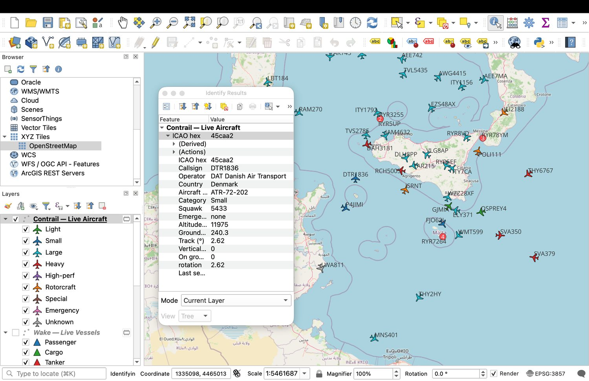
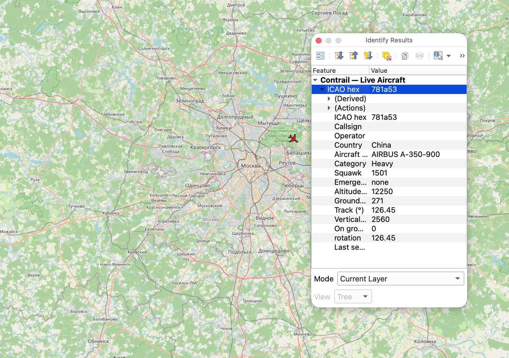
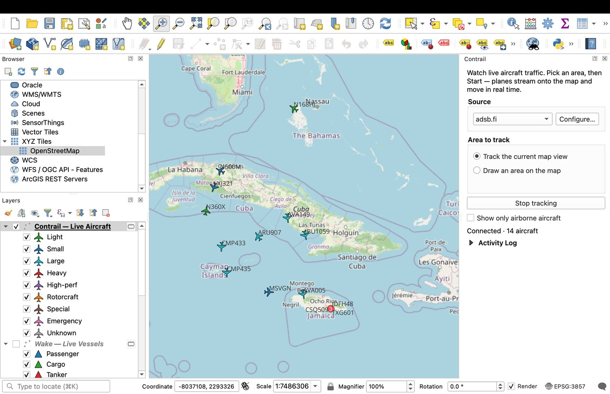

# Contrail

Watch **live aircraft traffic** on your map. Contrail streams real-time ADS-B
aircraft positions into QGIS and shows planes moving — track your current map
view, or draw an area to watch. Contrail shows *live* traffic only; it does not
replay history.

It's the sky-side companion to [Wake](https://github.com/PeterCotroneo/Wake),
which does the same for live marine vessel traffic.



## What is ADS-B?

**ADS-B** (Automatic Dependent Surveillance–Broadcast) is how modern aircraft
announce themselves. Several times a second, an aircraft broadcasts its identity,
GPS position, altitude, speed and heading over the radio — no interrogation
needed, it just *tells* everyone. Ground receivers (many run by hobbyists) pick
up those broadcasts and pool them into open networks.

Contrail taps those open networks, so the planes you see are real aircraft
reporting their own positions in real time. Because it's radio received on the
ground, coverage is best where people run receivers (dense over Europe and North
America, thinner elsewhere), and aircraft not transmitting ADS-B won't appear.

## Features

- **Area-based** — watch *all* traffic in your map view or a drawn box, not one flight at a time.
- **Free and keyless** — pick a provider in the panel; no account or API key for any of them:
  - **adsb.fi** — community ADS-B network (default).
  - **adsb.lol** — community ADS-B network.
  - **OpenSky Network** — global coverage (anonymous access is rate-limited).
- **Rich aircraft detail** — coloured by category and rotated to the aircraft's track, with callsign, country (from the ICAO address), operator (from the callsign), altitude, ground speed, vertical rate and squawk. Click any aircraft to Identify it, with one-click links out to ADS-B Exchange and FlightAware.
- **Emergency highlighting** — aircraft squawking 7500 / 7600 / 7700 are called out as their own category.
- **Cluster badges** — busy airspace collapses into a single marker with a count; zoom in and it fans out.
- **Show only airborne** — one toggle hides aircraft on the ground.
- **No extra dependencies** — uses QGIS's own network stack, so it installs cleanly from the QGIS plugin repository.

## Screenshots

Identify any aircraft for its full detail — here the ICAO address resolves to the
country (China) and the type (Airbus A350-900):



The callsign resolves to the operating airline, and coverage reaches wherever
receivers are — busy or quiet:



## Install

1. Download this repository as a ZIP (or clone it).
2. In QGIS: **Plugins → Manage and Install Plugins → Install from ZIP**, and select the zipped `contrail/` folder, or copy `contrail/` into your QGIS plugins directory.
3. Enable **Contrail** in the plugin list. A **Contrail** panel appears on the right.

## Usage

1. In the **Contrail** panel, choose a **Source** (all are keyless — no Configure step needed).
2. Choose **Track the current map view** or **Draw an area on the map**.
3. Click **Start tracking**. Aircraft stream in and move in real time. Pan or zoom and the watched area follows.

## Layout

```
contrail/
  metadata.txt          QGIS plugin metadata
  __init__.py           classFactory entry point
  contrail_plugin.py    dock panel, area selection, start/stop, clustering + airborne filter
  aircraft.py           live aircraft layer, batched updates, category styling, session memory
  config_dialog.py      schema-driven provider configuration dialog
  icao.py               ICAO 24-bit hex -> country lookup
  airlines.py           ICAO callsign designator -> operating airline
  providers/
    base.py             AircraftProvider abstraction + normalised aircraft contract
    adsb.py             adsb.lol and adsb.fi providers (keyless REST polling)
    opensky.py          OpenSky Network provider (keyless bounding-box polling)
    __init__.py         provider registry
```

## Requests

Want a specific ADS-B provider added? I'm happy to add one. Ping me at
**peter.cotroneo.qgis@gmail.com** with the source and I'll take a look.

## License

GPL-2.0-or-later.
